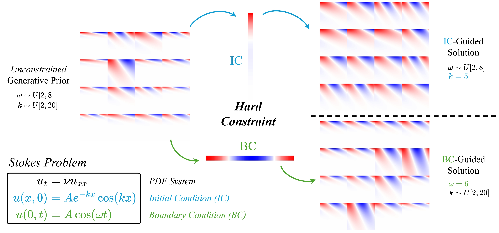

# ECI-Sampling: Gradient-Free Generation for Hard-Constrained Systems

By [Chaoran Cheng](https://github.com/ccr-cheng), Feb 28, 2025




This is the official code repo for the ICLR 2025 paper *Gradient-Free Generation for Hard-Constrained Systems* by Chaoran Cheng, Boran Han, Danielle C. Maddix, Abdul Fatir Ansari, Andrew Stuart, Michael W. Mahoney, and Bernie Wang. We present **ECI-sampling** (stands for *extrapolation-correction-interpolation*) as a novel framework for adapting pre-trained, unconstrained generative models to exactly satisfy constraints in a zero-shot manner, without requiring expensive gradient computations or fine-tuning. The paper is available on [arXiv](https://arxiv.org/abs/2412.01786).


## Setup

Run the following command to set up the environment:

```bash
conda env create -f env.yml
```

Most of our datasets are *synthetic*, meaning we generate the exact solutions on the fly. For the 2D Navier-Stokes (NS) equation, the data are *simulated*, meaning they were generated using numerical solvers. You can run the following command to generate the solutions for the NS equation:

```bash
cd datasets/generate
python generate_ns_2d.py --root ../data/ns/ --nw 100 --nf 100 --s 64 --steps 50 --mu 1e-3
```

The above script will generate the NS solution data to the directory of `../data/ns/` with 100 initial vorticities, 100 forcing terms, a spatial resolution of 64 × 64, 50 time snapshots, and a viscosity of 1e-3. See the argparser doc in `generate_ns_2d.py` for more details.


## Usage

### Model Pre-Training

To train a functional flow matching (FFM) model as the generative prior, run:

```bash
python main.py configs/stokes.yml --savename stokes
```

The above command trains an FFM on the Stokes problem dataset. Most arguments in `main.py` and the config files under the `configs` directory are self-explanatory. Feel free to modify them to suit your needs. Or, you can use `pytorch-lightning` with multi-GPU support on the larger Navier-Stokes dataset with the following command:

```bash
python main_lightning.py configs/ns_lightning.yml --savename ns_lightning
```

The model architecture is largely inspired by the [FFM repo](https://github.com/GavinKerrigan/functional_flow_matching). 

To train a conditional FFM model, run:

```bash
python train_cond.py configs/stokes_cond.yml --savename stokes_ic
```

The current `stokes_cond.yml` is configured for the Stokes problem with initial condition (IC) constraints. Modify the `cond_type` field to `bc` for boundary condition (BC) constraints, `icbc` for both IC and BC, and `first15` for the first 15 frames in the NS equation in `ns_cond.yml`.

To train a regression FNO model, run:

```bash
python train_fno.py configs/stokes_fno.yml --savename stokes_fno
```

### Constraint Enforcement

We implement the hard constraints in `models/constraints.py`, which has the following class hierarchy:

```
- Constraint (abstract)
    - ChainCondition
    - NoneCondition
    - DirichletCondition
    - DirichletXtCondition
        - DirichletX0Condition
            - InitialCondition
            - BoundaryCondition
        - DirichletXnCondition
    - PeriodicCondition
    - ConservationLaw
```

You can add your own constraint class by inheriting the proper class and implementing the `adjust` method.

### Sampling

Built upon the pre-trained FFM model, we implement the following sampling methods:

- `sample`: The standard FFM sampling process using an adaptive ODE solver. For conditional FFM, this method serves as the conditional sampling approach.
- `eci_sample`: Our proposed ECI sampling scheme by interleaving extrapolation, correction, and interpolation steps.
- `guided_sample`: Gradient-guided sampling from [DiffusionPDE](https://arxiv.org/abs/2406.17763).
- `dflow_sample`: [D-Flow](https://arxiv.org/abs/2402.14017) sampling by differentiating through the ODE solver.

Please refer to `models/functional.py` for more detailed documentation. We also provide examples of ECI sampling with the pre-trained FFM model in `eci_sample.ipynb`under the notebook directory. Furthermore, we provide `fpd.ipynb` for the calculation of Fréchet Poseidon Distance (FPD) between two sets of solutions using the pre-trained PDE foundation model, [Poseidon-B](https://arxiv.org/abs/2405.19101). Install either JupyterLab or Jupyter Notebook if you want to run these notebooks.


## Security

See [CONTRIBUTING](CONTRIBUTING.md#security-issue-notifications) for more information.


## License

This project is licensed under the Apache-2.0 License.


## Citation

If you find our work helpful, please consider citing our paper with

```bibtex
@inproceedings{
  cheng2025gradientfree,
  title={Gradient-Free Generation for Hard-Constrained Systems},
  author={Chaoran Cheng and Boran Han and Danielle C. Maddix and Abdul Fatir Ansari and Andrew Stuart and Michael W. Mahoney and Bernie Wang},
  booktitle={The Thirteenth International Conference on Learning Representations},
  year={2025},
  url={https://openreview.net/forum?id=teE4pl9ftK}
}
```

